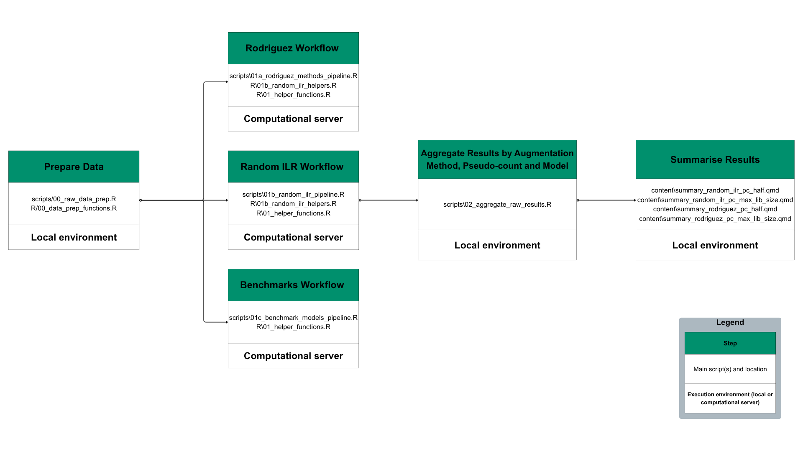

# README

# Overview

This repository contains the R code for the master’s thesis introducing
random ILR–based data-augmentation techniques for compositional data.
The newly proposed methods are compared with existing techniques from
Gordon-Rodriguez, Quinn, and Cunningham ([2022](#ref-gordon2022data))
using twelve microbiome classification tasks from Vangay, Hillmann, and
Knights ([2019](#ref-vangay2019microbiome)). The interactive summary of
the experiments’ results, along with other analyses conducted in the
thesis, is available at [project’s GitHub Pages
site](https://oktawiamil.github.io/random_ilr_thesis).

This repository organizes R scripts, datasets, and outputs for the
thesis project. The main analysis scripts are in the `scripts/` folder,
and their filenames indicate execution order (e.g.,
`scripts/00_raw_data_prep` should be run first). Files in `R/` contain
helper functions for other scripts in this repository. They are named
after the scripts that call them, e.g. `R/00_data_prep_functions.R` is
called by `scripts/00_raw_data_prep`. Raw input data is expected under
`data/data_raw` and analysis outputs are saved under `results` in the
appropaite subfolder in the appropriate subfolders. For example, results
from experiments using random ILR augmentation techniques are saved in
`results/random_ilr`.

## Project Structure

    .
    ├── bash/                  # Shell scripts that call code in scripts/ (used on the computational server)
    ├── content/               # Quarto source (.qmd) for interactive dashboards published via GitHub Pages
    │   ├── _figures/           # PNG figures rendered by the Quarto scripts (not tracked)
    │   └── _tables/            # LaTeX code of selected tables generated by the Quarto scripts
    ├── data/
    │   ├── data_raw/           # Raw, unmodified input data
    │   └── data_preproc/       # Preprocessed data
    ├── docs/
    │   └── content/            # Rendered dashboards HTML shown on the project’s GitHub Pages site
    │       └── figures/          # PNG figures emitted during rendering (public)
    ├── logs/                  # Error and message logs produced by the bash jobs
    ├── R/                     # Reusable R helper functions
    ├── renv/                  # Files used by renv to reproduce the local R environment
    ├── results/
    │   ├── benchmark/          # Per-run results for benchmark models
    │   ├── random_ilr/         # Per-run results for random-ILR augmentation methods
    │   ├── rodriguez/          # Per-run results for Rodriguez augmentation methods
    │   └── results_aggregated/ # Aggregated results by method-model-pseudo-count
    ├── scripts/               # R analysis scripts invoked by the bash wrappers
    ├── README_files/          # Assets referenced by README (images, BibTeX file)
    ├── _quarto.yml            # Quarto site config for publishing dashboards from docs/
    ├── .gitignore
    └── README.md

## Getting Started

### Setup

1.  Clone the repository.
2.  Open the project in your preffered IDE.
3.  Run `renv::restore()`. This restores the package versions recorded
    in `renv.lock` so you can reproduce the analysis that was done
    locally.

### Running the Pipeline

The below graph explains the workflow needed to recreate the results
obtained in the thesis with the specification whether a given step was
run locally in the environmant specified by the `renv.loc` or on the
computational server in the custom Docker image.

## Data

The twelve datasets used for the experiments conducted in this project
are taken from Vangay, Hillmann, and Knights
([2019](#ref-vangay2019microbiome)). The below table summarizes the
exact datasets used along with its dimensionality and outcome. All
datasets used in this project are **taxa data** that used **RefSeq** as
the reference sequence database.

| Task | n | p | Class 1/ 2 | \# Class 1 | \# Class 2 | Source |
|:--:|:--:|:--:|:--:|:--:|:--:|:--:|
| 1 | 140 | 992 | Crohn’s disease / Healthy (ileum) | 78 | 62 | ([Gevers et al. 2014](#ref-gevers2014treatment)) |
| 2 | 160 | 992 | Crohn’s disease / Healthy (rectum) | 68 | 92 | ([Gevers et al. 2014](#ref-gevers2014treatment)) |
| 3 | 2070 | 3090 | Gastrointestinal tract / Oral | 227 | 1843 | ([“Structure, Function and Diversity of the Healthy Human Microbiome” 2012](#ref-human2012structure)) |
| 4 | 180 | 3090 | Female / Male | 82 | 98 | ([“Structure, Function and Diversity of the Healthy Human Microbiome” 2012](#ref-human2012structure)) |
| 5 | 404 | 3090 | Stool / Tongue dorsum | 204 | 200 | ([“Structure, Function and Diversity of the Healthy Human Microbiome” 2012](#ref-human2012structure)) |
| 6 | 408 | 3090 | Subgingival plaque / Supragingival plaque | 203 | 205 | ([“Structure, Function and Diversity of the Healthy Human Microbiome” 2012](#ref-human2012structure)) |
| 7 | 172 | 980 | Healthy / Colorectal cancer | 86 | 86 | ([Kostic et al. 2012](#ref-kostic2012genomic)) |
| 8 | 124 | 2526 | Diabetes / Healthy | 59 | 65 | ([J. Qin et al. 2012](#ref-qin2012metagenome)) |
| 9 | 130 | 2579 | Cirrhosis / Healthy | 68 | 62 | ([N. Qin et al. 2014](#ref-qin2014alterations)) |
| 10 | 199 | 660 | Black / Hispanic | 104 | 95 | ([Ravel et al. 2011](#ref-ravel2011vaginal)) |
| 11 | 342 | 660 | Nugent score high / Low | 97 | 245 | ([Ravel et al. 2011](#ref-ravel2011vaginal)) |
| 12 | 200 | 660 | Black / White | 104 | 96 | ([Ravel et al. 2011](#ref-ravel2011vaginal)) |

To re-run the analysis, place original datasets downloaded from
([Vangay, Hillmann, and Knights 2019](#ref-vangay2019microbiome)) in
`data/raw/`.

## Data preprocessing

Code used for data preprocessing can be found in `R/00_raw_data_prep.R`.

## Reproducibility

The environment used for the local analysis can be recreated by running
`renv::restore()`. Code on the computational server was executed inside
a container built from a custom image. This image is based on Rocker
Tidyverse 4.4.3 and includes several additional R packages
(tidymodels, glmnet, ranger, xgboost, augmenter, compositions, rlang).
The image used in the analysis can be accessed at [project’s Zenodo
site](https://doi.org/10.5281/zenodo.17392972).

## Results

The results for each model, augmentation class (random ILR or Rodriguez
techniques) / benchmark, and pseudo-count are available at [project’s
Zenodo site](https://doi.org/10.5281/zenodo.17392972) as RDS files. The
file-naming convention is: `augmentation_class_model_pseudo_count`.

## License

This project is released under the MIT License. See the
[`LICENSE`](LICENSE) file for details.

## References

Gevers, Dirk, Subra Kugathasan, Lee A Denson, Yoshiki Vázquez-Baeza,
Will Van Treuren, Boyu Ren, Emma Schwager, et al. 2014. “The
Treatment-Naive Microbiome in New-Onset Crohn’s Disease.” *Cell Host &
Microbe* 15 (3): 382–92.

Gordon-Rodriguez, Elliott, Thomas Quinn, and John P Cunningham. 2022.
“Data Augmentation for Compositional Data: Advancing Predictive Models
of the Microbiome.” *Advances in Neural Information Processing Systems*
35: 20551–65.

Kostic, Aleksandar D, Dirk Gevers, Chandra Sekhar Pedamallu, Monia
Michaud, Fujiko Duke, Ashlee M Earl, Akinyemi I Ojesina, et al. 2012.
“Genomic Analysis Identifies Association of Fusobacterium with
Colorectal Carcinoma.” *Genome Research* 22 (2): 292–98.

Qin, Junjie, Yingrui Li, Zhiming Cai, Shenghui Li, Jianfeng Zhu, Fan
Zhang, Suisha Liang, et al. 2012. “A Metagenome-Wide Association Study
of Gut Microbiota in Type 2 Diabetes.” *Nature* 490 (7418): 55–60.

Qin, Nan, Fengling Yang, Ang Li, Edi Prifti, Yanfei Chen, Li Shao, Jing
Guo, et al. 2014. “Alterations of the Human Gut Microbiome in Liver
Cirrhosis.” *Nature* 513 (7516): 59–64.

Ravel, Jacques, Pawel Gajer, Zaid Abdo, G Maria Schneider, Sara SK
Koenig, Stacey L McCulle, Shara Karlebach, et al. 2011. “Vaginal
Microbiome of Reproductive-Age Women.” *Proceedings of the National
Academy of Sciences* 108 (supplement_1): 4680–87.

“Structure, Function and Diversity of the Healthy Human Microbiome.”
2012. *Nature* 486 (7402): 207–14.

Vangay, Pajau, Benjamin M Hillmann, and Dan Knights. 2019. “Microbiome
Learning Repo (ML Repo): A Public Repository of Microbiome Regression
and Classification Tasks.” *Gigascience* 8 (5): giz042.

